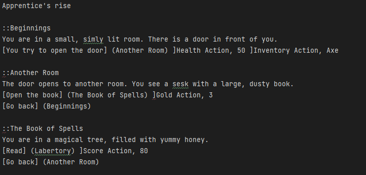

# Paths

Paths is a game for choice-based and interactive storytelling.
The engine contains features such as elementary classes,logic, filehandler and a graphical user interface.

Within the game you can find a default game file. This file will put the player into a story
were the player must choose their name, gold, inventory and score.  
Next he must insert he's/she's preferred goals. Which consist of health, goal, score , and inventory goals.

The game engine will generate the rooms within the game according to the file provided. Our engine also supports custom files as
long as they follow our file structure ".paths"

---

## Running the application

To run our game engine, run the following command:

    mvn clean package javafx:run

## Installing
To install the `.jar` file that can be used for running our game engine, run the following command:

    mvn clean install

## Testing
To run the unit tests, use the following command:

    mvn clean test

---

## File format

Here is an exmaple on the file format:

Passages are defined by using "::"  were you insert the tittle on the same line and the description of the passage on the next line. 
Passage Example: lets say you want to create a passage named "Home" with the description "Home sweet home" you can do so by typing it in like this in the file  
"::Home" and then go to a new line and enter the description "Home sweet home". It should look like this:  

::Home 
Home sweet home 

Then if you want a link on the passage, for example named " Go back to the beginning" that leads to the passage "Beginning".  
You can do so by typing the name between these "[]" and the reference on the same line between these "()".  
It should look like this: 

---
## Code contributers
This project exists thanks to all the people who contribute.

👤Vegard Mything

👤Jan Nordkosg

---
## Author
👤Vegard Mything

👤Jan Nordkosg

